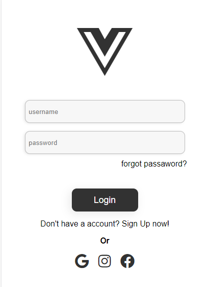
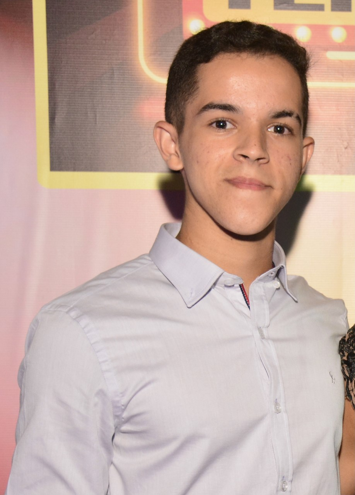

# My Portfolio 

<!---Esses são exemplos. Veja https://shields.io para outras pessoas ou para personalizar este conjunto de escudos. Você pode querer incluir dependências, status do projeto e informações de licença aqui--->

> Aba de Login do aplicativo Yoga.

### Ajustes e melhorias

✅ O projeto foi concluído.

- [x] Corpo com HTML.
- [x] Estilização com CSS.

## 🤝 Colaborador

<table>
  <tr>
    <td align="center">
      <a href="#">
         
        
          <b>João Guilherme</b>
        
      </a>
    </td>
  </tr>
</table>

## Tecnologias
Tecnologias usadas no projeto:

 
